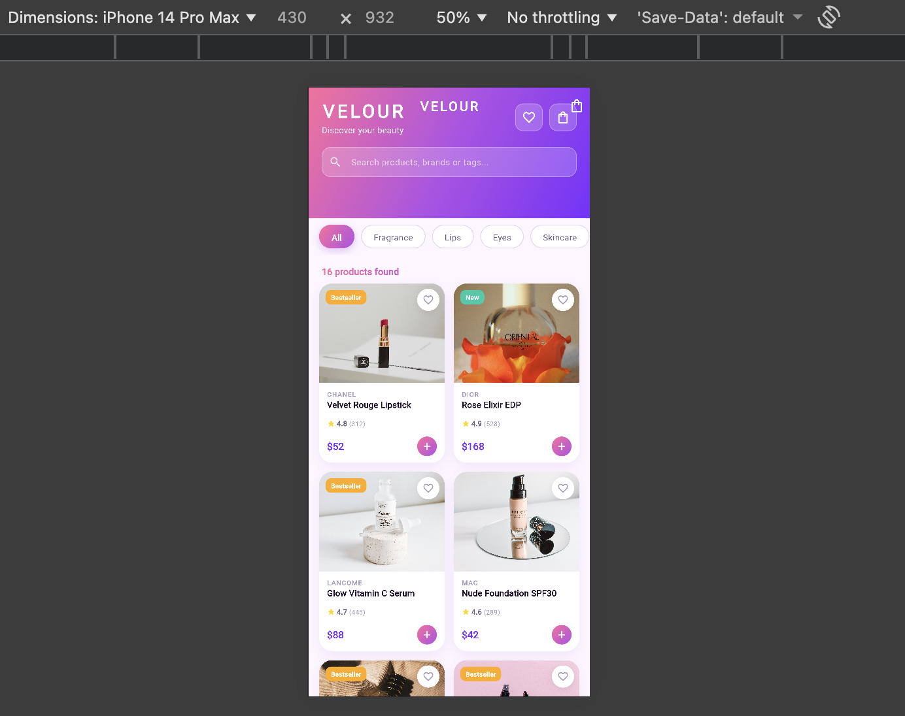

# Velour – Beauty & Fragrance Catalog

A Flutter-based mobile catalog app for cosmetics and fragrances. Built as part of a mobile development internship project, focusing on real-world UI patterns, navigation, and data modeling.

## Screenshots

<p float="left">
  
  
  
  
</p>

## Overview

Velour is a product catalog app featuring 16 premium beauty products across six categories. Users can browse, search, filter by category, save favorites, and manage a shopping cart — all with smooth navigation and a clean gradient UI.

The project was an opportunity to put several Flutter concepts into practice at once: custom widgets, named routes with arguments, JSON-based data modeling, and state management without any external packages.

## Features

- **Product Grid** — 16 products in a responsive 2-column grid with cover images, brand labels, star ratings, and New/Bestseller badges
- **Search** — real-time filtering by product name, brand, or tag
- **Category Filter** — chip bar to filter by Fragrance, Lips, Eyes, Skincare, Base, or Cheeks
- **Product Detail** — full description, tags, star rating, review count, quantity selector, and add to cart
- **Cart** — add/remove items, adjust quantities, swipe-to-delete, order total, checkout dialog
- **Wishlist** — save favorite products, add directly to cart from the wishlist
- **Splash Screen** — animated logo intro with scale and fade transitions
- **Gradient UI** — pink-to-purple gradient theme across all screens

## Project Structure
```
lib/
├── main.dart
├── theme/app_theme.dart
├── models/product.dart
├── models/cart_item.dart
├── data/product_data.dart
├── screens/splash_screen.dart
├── screens/home_screen.dart
├── screens/product_detail_screen.dart
├── screens/cart_screen.dart
├── screens/favorites_screen.dart
├── widgets/product_card.dart
├── widgets/category_chip.dart
└── widgets/gradient_app_bar.dart
```

## Getting Started

**Requirements:** Flutter 3.41.4, Dart 3.11.1
```bash
git clone https://github.com/Hattapoglu-Ebru/velour.git
cd velour
flutter pub get
flutter run -d chrome
```

## Live Demo

[velourmakeup.netlify.app](https://velourmakeup.netlify.app)

## Dependencies

No third-party packages. Everything built with `material.dart`.

