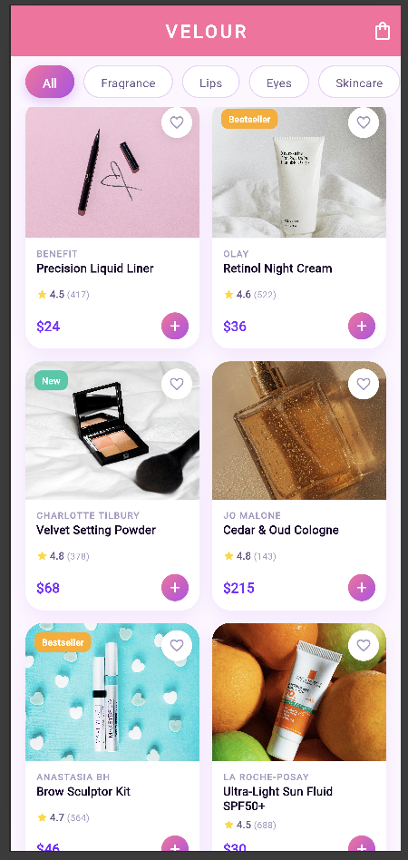
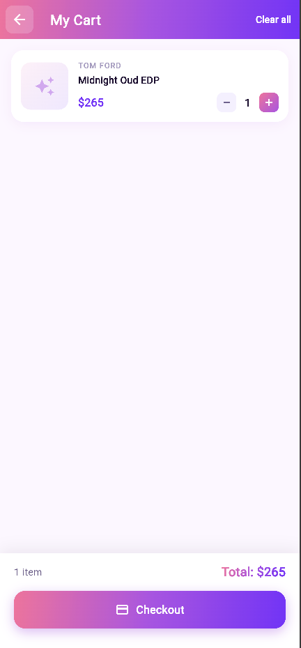

# ✨ Glamora – Beauty & Perfume Catalog

<p align="center">
  
  
  
  
</p>

## 📖 Proje Açıklaması

**Glamora**, Flutter ile geliştirilmiş modern bir kozmetik ve parfüm katalog uygulamasıdır. 16 farklı premium marka ürününü kategori filtresi, arama, favori ve sepet özellikleriyle şık bir tasarımda sunar.

Proje; widget mimarisi, sayfa geçişleri (Navigator), Route Arguments, JSON veri modelleme ve state yönetimi konularını kapsamlı biçimde uygulamaktadır.

---

## 🎯 Özellikler

| Özellik | Açıklama |
|---|---|
| 🔍 **Arama & Filtreleme** | Ürün adı, marka veya etikete göre gerçek zamanlı arama |
| 🏷️ **Kategori Filtresi** | Parfüm, Dudak, Göz, Cilt Bakım, Ten Rengi, Yanak |
| ❤️ **Favoriler** | Kalp ikonuyla beğenilen ürünleri kaydet |
| 🛒 **Sepet Sistemi** | Miktar güncelleme, sürükle-sil, toplam hesaplama |
| 📦 **Ürün Detayı** | Puan, açıklama, etiketler, miktar seçici |
| ✨ **Splash Screen** | Animasyonlu açılış ekranı |
| 🌈 **Gradient Tasarım** | Pembe-mor modern renk paleti |
| 🔖 **Badge Sistemi** | "Yeni" ve "Çok Satan" etiketleri |

---

## 🏗️ Proje Yapısı

```
lib/
├── main.dart                  # Uygulama girişi & Named Routes
├── theme/
│   └── app_theme.dart         # Renkler, gradientler, ThemeData
├── models/
│   ├── product.dart           # Ürün modeli (fromJson / toJson)
│   └── cart_item.dart         # Sepet öğesi modeli
├── data/
│   └── product_data.dart      # JSON simülasyonu (16 ürün)
├── screens/
│   ├── splash_screen.dart     # Animasyonlu splash
│   ├── home_screen.dart       # Ana ekran (grid, arama, filtre)
│   ├── product_detail_screen.dart  # Ürün detayı (Route Args)
│   ├── cart_screen.dart       # Sepet ekranı
│   └── favorites_screen.dart  # Favoriler ekranı
└── widgets/
    ├── product_card.dart      # Ürün kartı widget'ı
    ├── category_chip.dart     # Kategori filtre chip'i
    └── gradient_app_bar.dart  # Gradient AppBar widget'ı
```

---

## 🔧 Kullanılan Flutter Sürümü

```
Flutter 3.x.x (stable)
Dart 3.x.x
```

> Projeyi çalıştırmadan önce `flutter --version` komutunu çalıştırarak sürümünüzü kontrol edin.

---

## 🚀 Çalıştırma Adımları

### 1. Repoyu klonlayın
```bash
git clone https://github.com/KULLANICI_ADINIZ/glamora.git
cd glamora
```

### 2. Bağımlılıkları yükleyin
```bash
flutter pub get
```

### 3. Emülatörü başlatın veya cihazınızı bağlayın
```bash
flutter devices
```

### 4. Uygulamayı çalıştırın
```bash
flutter run
```

### 5. Release APK almak için (opsiyonel)
```bash
flutter build apk --release
```

---

## 📱 Ekranlar

| Ekran | Açıklama |
|---|---|
| **Splash Screen** | Logo animasyonu, uygulamayı karşılar |
| **Home Screen** | Ürün grid'i, arama çubuğu, kategori filtreleri |
| **Product Detail** | Detaylı ürün bilgisi, miktar seçici, sepete ekle |
| **Cart Screen** | Sepet yönetimi, miktar güncelleme, ödeme simülasyonu |
| **Favorites Screen** | Favorilere eklenen ürünler listesi |

---

## 📦 Kullanılan Paketler

```yaml
dependencies:
  flutter:
    sdk: flutter
  cupertino_icons: ^1.0.2
```

> Ekstra paket kullanılmamıştır. Tüm bileşenler Flutter'ın `material.dart` paketi ile geliştirilmiştir.

---

## 🎨 Teknik Detaylar

- **State Yönetimi:** `setState` ile lokal state
- **Navigasyon:** `Navigator.push` + `MaterialPageRoute` + **Named Routes**
- **Veri Aktarımı:** **Route Arguments** (`ModalRoute.of(context).settings.arguments`)
- **Veri Modeli:** `fromJson` / `toJson` metodları ile JSON simülasyonu
- **UI Bileşenleri:** `SliverAppBar`, `SliverGrid`, `ListView.builder`, `GridView`, `Dismissible`

---

## 👩‍💻 Geliştirici

Bu proje Flutter mobil uygulama geliştirme eğitimi kapsamında geliştirilmiştir.

---

*Made with 💜 using Flutter*
